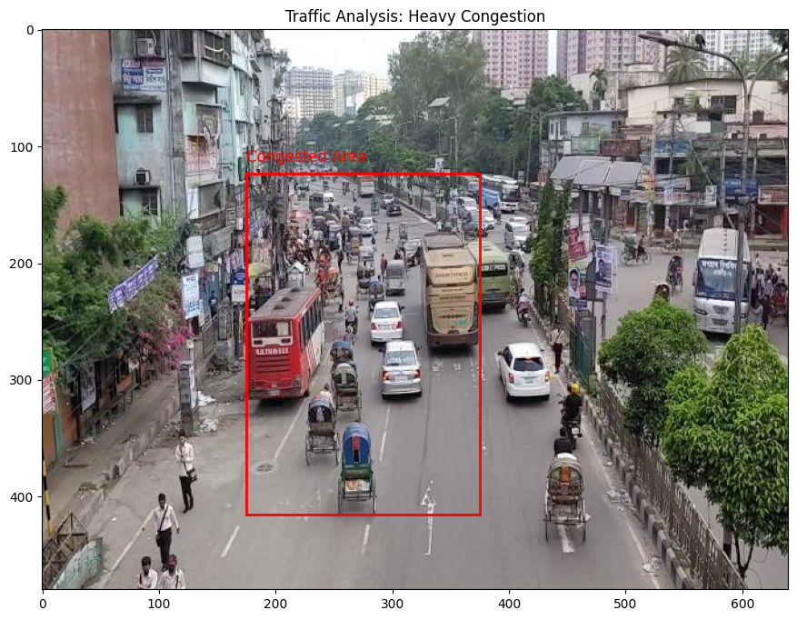
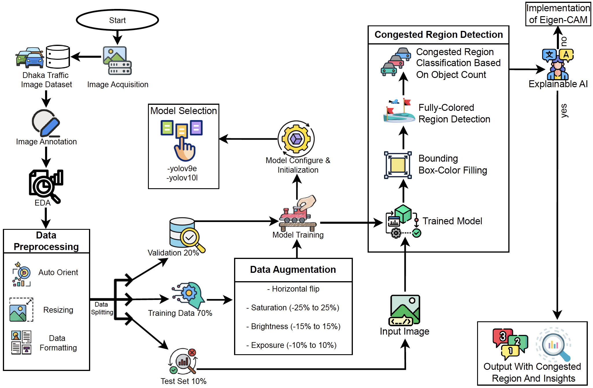
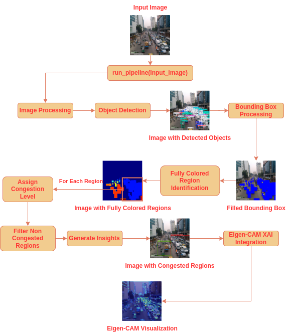
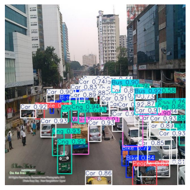
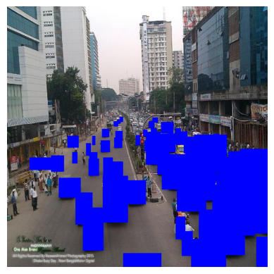
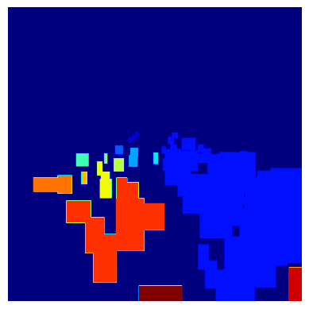
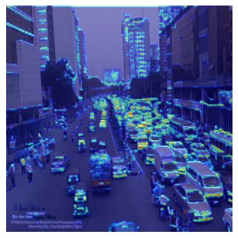

# Deep Learning for Explainable Traffic Anomaly Detection in Dhaka

## Overview
This repository contains my research and development work on Deep Learning for Explainable Traffic Anomaly Detection in Dhaka. The project introduces a Multi-Stage Traffic Anomaly Analysis Framework for identifying and analyzing urban traffic congestion, particularly in Dhaka. Originally utilizing Faster R-CNN and DBSCAN, it has been upgraded to state-of-the-art YOLOv9e and YOLOv10l models for enhanced accuracy and efficiency. By integrating object detection, congestion analysis, and explainable AI techniques, TCRD provides actionable insights to improve urban traffic management and planning.

## Key Contributions
- **Upgraded Object Detection:** Transitioned from **Faster R-CNN** to **YOLOv9e** and **YOLOv10l** for real-time, high-accuracy traffic analysis.
- **Advanced Anomaly Detection:** Implemented **clustering-based** methods to analyze traffic patterns and detect congested regions.
- **Explainable AI (XAI):** Integrated **Eigen-CAM** to visualize model decisions, enhancing transparency in traffic anomaly detection.
- **Data Processing:** Adopted the **YOLOv9 format** for data structuring and annotation.
- **Multi-Stage Analysis Framework:** Combined object detection, colored bounding boxes, connected components, and density-based counting for anomaly assessment.

---

## Project Structure

- `faster-r-cnn/dhaka-vehicle-detection-faster-r-cnn.ipynb`: Notebook for training the Faster R-CNN model to detect vehicles and people.
- `region_detection_with_dbscan/congested-region-detection-using-dbscan.ipynb`: Notebook for detecting congested regions using DBSCAN based on the output from the Faster R-CNN model.
- `final-tcrd-framework.ipynb`: Core implementation of the Multi-Stage Traffic Anomaly Analysis Framework (TCRD) utilizing the YOLOv10l model.
- `yolov9e/tcd_v9_version2_e50.ipynb`: Notebook for training YOLOv9e for traffic congestion detection.
- `yolov10l/YOLOv10_120E.ipynb`: Notebook for training YOLOv10l for advanced traffic anomaly detection.

## Implementation Environment
Kaggle is recommended for its GPU support and storage capabilities. The training and detection notebooks are designed for seamless execution in Kaggle.

## Models and Datasets
### Trained Models
1. **Faster-R-CNN**:
   - Original Dataset: Bangladesh Traffic Flow Dataset ([DOI: 10.17632/h8bfgtdp2r.2](https://doi.org/10.17632/h8bfgtdp2r.2))
   - [COCO Formatted Dataset](https://www.kaggle.com/datasets/samiatisha/dhaka-city-traffic-2024/data)
   - Implementation: [`dhaka-vehicle-detection-faster-r-cnn.ipynb`](faster-r-cnn/dhaka-vehicle-detection-faster-r-cnn.ipynb)
   		- **Model Initialization:** Initialize a Faster R-CNN model with pre-trained weights.
			- **Output:** The model with the lowest average loss (0.3135 from the 17th epoch) is selected for further congestion detection.
   - Weights: Download from [Kaggle](https://www.kaggle.com/datasets/samiahaquetisha/better-models-faster-rcnn/data) and place them in the Kaggle input.
   - Training Parameters:
			- **Backbone:** ResNet-50
			- **Optimizer:** ADAM
			- **Learning Rate:** 0.0001
			- **Batch Size:** 4
			- **Epochs:** 20
			- **Scheduler:** StepLR (step size=3, gamma=0.1)
			
2. **YOLOv9e**:
   - Original Dataset: Bangladesh Traffic Flow Dataset ([DOI: 10.17632/h8bfgtdp2r.2](https://doi.org/10.17632/h8bfgtdp2r.2))
   - [YOLOv9 Formatted Dataset](https://universe.roboflow.com/tishas-workspace/traffic-congestion-detection-16ol4)
   - Implementation: [`yolov9e/tcd_v9_version2_e50.ipynb`](yolov9e/tcd_v9_version2_e50.ipynb)
   - Results stored in: [`yolov9e/detect/yolov9e_ppe_css_50_epochs`](yolov9e/detect/yolov9e_ppe_css_50_epochs)
   - Weights: Download from [Google Drive](https://drive.google.com/drive/folders/1kFKvWHMlVikhZLVioI_HUifzeo9QwGAk?usp=drive_link) and place them in [`yolov9e/detect/yolov9e_ppe_css_50_epochs/weights`](yolov9e/detect/yolov9e_ppe_css_50_epochs/weights)
   - Metrics (50 epochs):
     - Precision: 0.667
     - Recall: 0.764
     - mAP50: 0.764
     - mAP50-95: 0.508

3. **YOLOv10l**:
   - Original Dataset: Dhaka AI Traffic Dataset ([DOI: 10.7910/DVN/POREXF](https://doi.org/10.7910/DVN/POREXF))
   - [YOLOv9 Formatted Dataset](https://universe.roboflow.com/tishas-workplace/traffic-congestion-detection-vbbnb)
   - Implementation: [`yolov10l/YOLOv10_120E.ipynb`](yolov10l/YOLOv10_120E.ipynb)
   - Results stored in: [`yolov10l/detect`](yolov10l/detect)
   - Weights: Download from [Google Drive](https://drive.google.com/drive/folders/1pz7fTob5Og9fvO0wDZZKb-zWogfy_7ML?usp=drive_link) and place them in [`yolov10l/detect/weights`](yolov10l/detect/weights)
   - Metrics (120 epochs):
     - Precision: 0.794
     - Recall: 0.675
     - mAP50: 0.752
     - mAP50-95: 0.523
     
### Object Classes
The datasets focus on a congested urban environment with the following object classes:
- Bike
- Bus
- Car
- CNG
- Cycle
- Mini-Truck
- People
- Rickshaw
- Truck
     
---
     
## Previous Congestion Region Detection

Clustering methods were used with the Faster R-CNN model to test if congestion could be detected thoroughly.

### Congested Region Detection using DBSCAN

1. **Image Analysis:** Used the trained Faster R-CNN model to detect vehicles and people in images.
2. **Information Extraction:** Extracted relevant information such as the count of vehicles and people, and potential congested regions.
3. **DBSCAN Clustering:** Applied DBSCAN clustering to identify congested regions based on the density of detected objects.
4. **Visualization:** Visualized the images with marked congested regions.

DBSCAN Parameters:
- **eps:** 75 (the maximum distance between two samples for one to be considered as in the neighborhood of the other)
- **min_samples:** 5 (the number of samples in a neighborhood for a point to be considered a core point)

Example Output:
```json
{
    "vehicle_count": 23,
    "people_count": 4,
    "congested_regions": [[175.94656, 123.34937, 375.40375, 415.21686]],
    "congestion_count": 1,
    "people_in_congested_areas": 0
}
```



### Limitations of the DBSCAN Clustering Method for Congestion Detection

As a matter of fact, congestion region detection was not thorough enough with the DBSCAN clustering method alone, as we can see in the output image. Therefore, new detection methods were needed for accuracy and clearer visualization. 

---

## Final Project Workflow
The project workflow is outlined in the following diagram:


## Framework Implementation
### Main File
The core implementation of the TCRD framework is in the file: [`final-tcrd-framework.ipynb`](final-tcrd-framework.ipynb). This file integrates the trained YOLOv10l model for:
1. Object detection.
2. Region congestion analysis.
3. Visualization of results.

### TCRD Framework Workflow Diagram
<div style="background-color: white; padding: 10px;">
  
</div>


### Sample Results
1. **Object Detection**:

   
   
   - Detected: 5 Bikes, 4 Buses, 42 Cars, 14 CNGs, 2 Mini-Trucks
   - Processing Time: 2750.6ms

3. **Blue Bounding Boxes**:

   

5. **Masked Local Regions**:

   
   
   - Total Regions: 15
   - Congestion Levels:
     - Region 2: **Heavy Congestion** with 43 boxes
     - Region 12: **Light Congestion** with 7 boxes

7. **Explainability with Eigen-CAM**:

   
   
   - Detected: 6 Bikes, 4 Buses, 46 Cars, 14 CNGs, 5 Mini-Trucks, 2 People
   - Processing Time: 2450.0ms


Now the Congestion Regions are more accurate and can be differentiated more clearly. They are even classified with detailed analysis and visualization.

---

## How to Use
1. **Set up YOLOv10 Weights**:
   - Download `best.pt` from [Google Drive](https://drive.google.com/drive/folders/1pz7fTob5Og9fvO0wDZZKb-zWogfy_7ML?usp=drive_link).
   - Place the file locally by creating a new directory `yolov10-models/weights/`.
   - Zip the folder and upload it to Kaggle as the `tcd-yolov10-models` dataset.

2. **Run the Framework**:
   - Upload `final-tcrd-framework.ipynb` to your Kaggle workspace.
   - Execute the notebook to process test images and analyze results.

---

## Contribution
Contributions to this repository are welcome! Potential improvements include:
- Training new models with updated datasets.
- Optimizing the TCRD framework for faster processing.
- Enhancing explainability methods.

---

## Future Impact
The TCRD framework aims to:
- Support government sectors in traffic management.
- Provide actionable insights for urban planning.
- Minimize congestion and reduce public health risks.

This work seeks to contribute to smarter, more sustainable cities.
